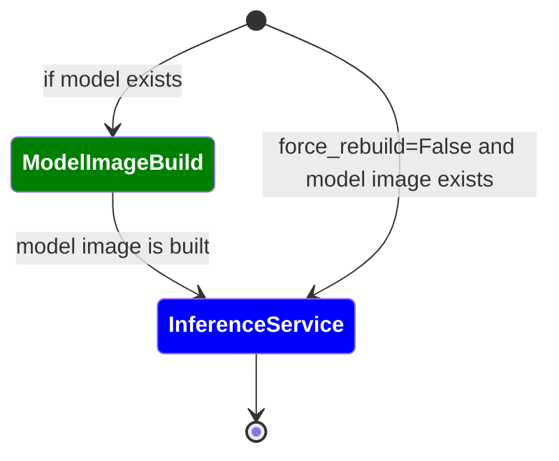
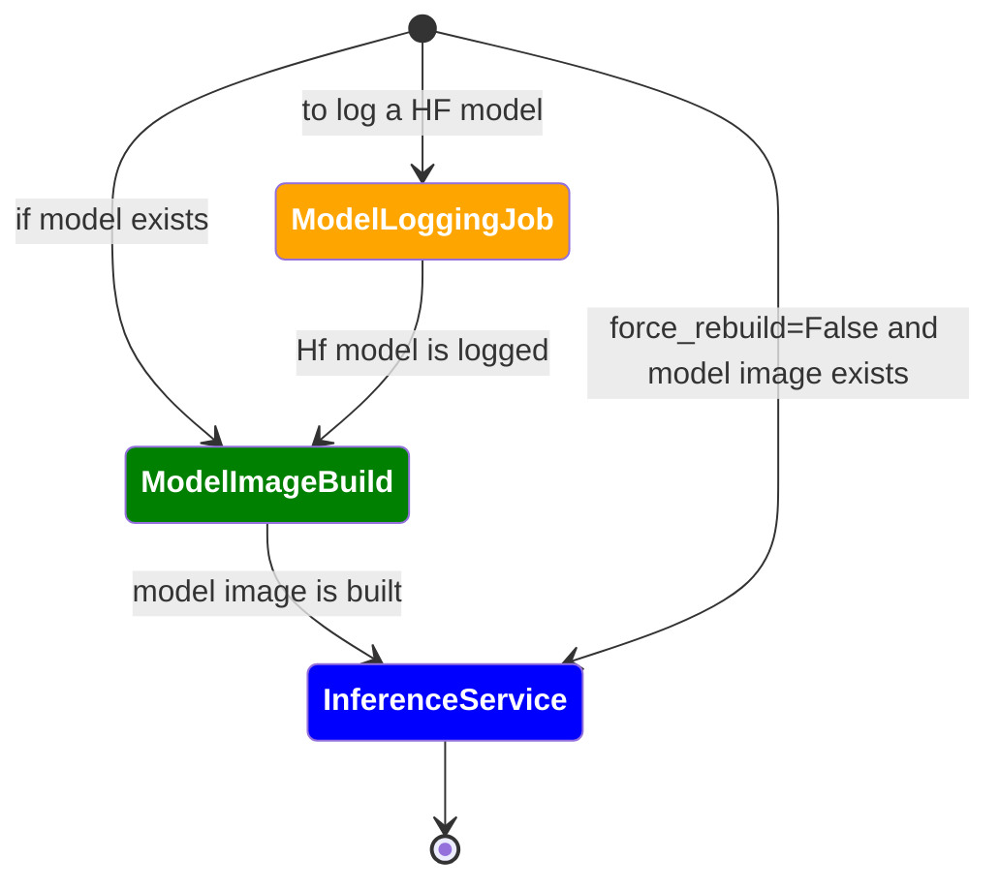

# Client Ops Directory

> **_NOTE:_**  This file is copied to OSS, please do not share any internal documentation.

## Metadata

## Model

## Service

### [Service Ops](./service_ops.py)

#### Before introducing model build sidecar (logging) container

#### After introducing model build sidecar (logging) container

